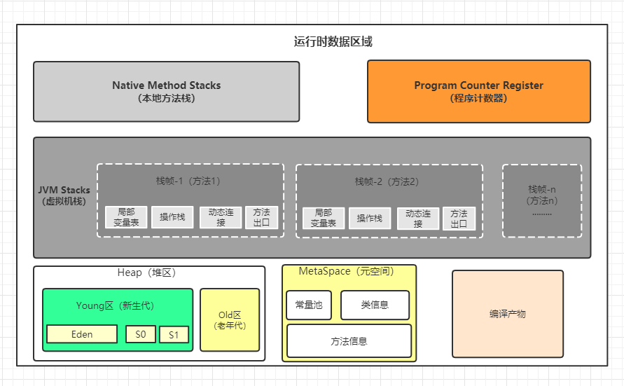

## 1.Java内存区域详解

[Java内存区域详解](https://javaguide.cn/java/jvm/memory-area.html)

## 2.JVM垃圾回收详解

[JVM垃圾回收详解](https://javaguide.cn/java/jvm/jvm-garbage-collection.html)

[《对线面试官》垃圾回收机制](https://mp.weixin.qq.com/s?__biz=MzU4NzA3MTc5Mg==&mid=2247485557&idx=1&sn=f04951ebdf495cb16e4ead2b7725b310&chksm=fdf0e02aca87693c56fd2911562efa4ad8840d690d9ca4fc6a84070f643bb59e709c6a2484fa&scene=178&cur_album_id=2137264927726764033#rd)

## 3.类文件结构详解

[类文件结构详解](https://javaguide.cn/java/jvm/class-file-structure.html)

## 4.类加载过程详解

[类加载过程详解](https://javaguide.cn/java/jvm/class-loading-process.html)

## 5.类加载器详解

[类加载器详解](https://javaguide.cn/java/jvm/classloader.html)

## 6.Java编译到执行的过程

[《对线面试官》Java编译到执行的过程](https://mp.weixin.qq.com/s/PCNAOXMUb3Wn_SkTYttKRw)

